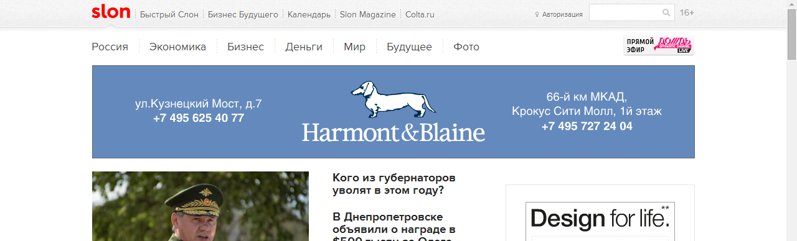
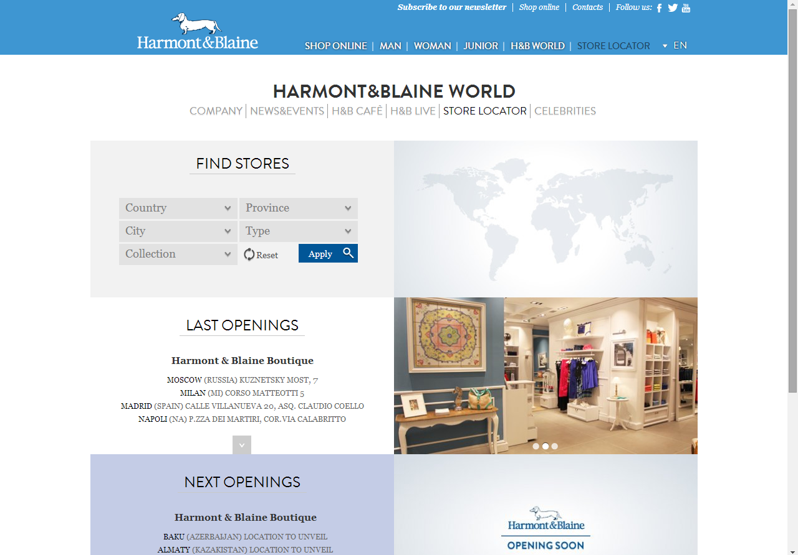

Сейчас на Слоне, между меню и непосредственно контентом сайта (одно из самых дорогих рекламных мест на любом сайте) появляется такой вот анимированный баннер Harmont Blaine:

Баннер красивый, но вот ведет он, я не шучу, вот сюда:

[http://www.harmontblaine.it/en/hb-world/store-locator](http://www.harmontblaine.it/en/hb-world/store-locator)

Это да же не сайт на русском языке. А первое что он предлагает сделать это… определить самому пользователю откуда он пришел. В баннере на сайте больше информации (и русских слов) чем на посадочной странице на которую этот баннер ведет — о да, там ведь и телефон есть, и адрес. О том что в ссылке не используется UTM разметка я и говорить не будут — при такой посадочной странице было бы странно ожидать хоть какого-то сбора статистики.
