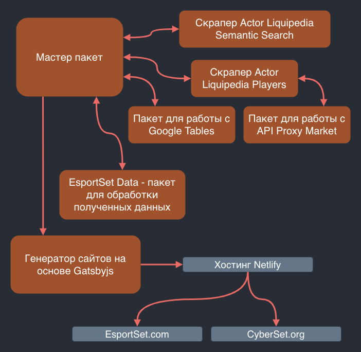
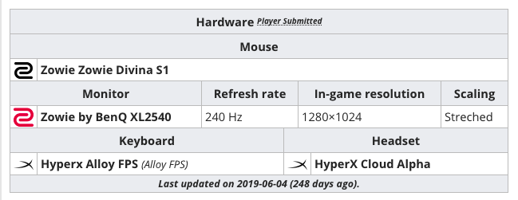
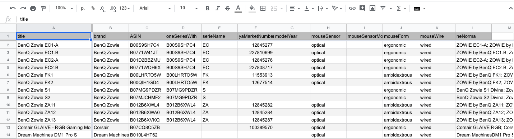
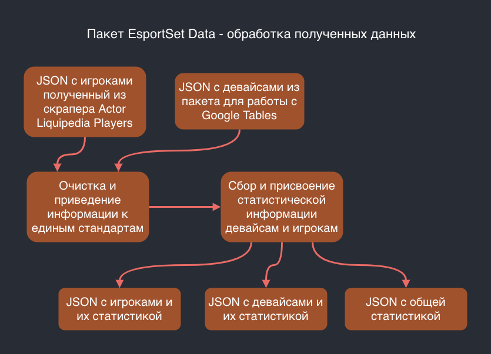

Сайты [EsportSet.com](https://www.esportset.com) и [CyberSet.org](https://www.cyberset.org) представляют из себя каталоги девайсов с фильтрами и поиском. Главная фишка в том что у каждого девайса собирается статистика по профессиональным игрокам которые используют этот девайс. Но откуда и как эта статистика берется? Как она обрабатывается? И как эти сайты вообще функционируют?

В этой статье я подробно расскажу о том как все это организовано внутри.

## Общая архитектура проекта

Сам по себе проект представляет из себя монорепозиторий. Организован монорепо при помощи [Yarn Workspaces](https://classic.yarnpkg.com/en/docs/workspaces) и [Lerna](https://github.com/lerna/lerna). Подробнее о том как такое можно организовать, читайте здесь: [Workspaces in Yarn](https://classic.yarnpkg.com/blog/2017/08/02/introducing-workspaces). Я не могу показать код и репо проекта EsportSet, но, на самом деле, архитектура схожа с моим опенсорсным проектом [Chronoblog](https://github.com/Chronoblog/gatsby-theme-chronoblog).

Ниже в статье речь будет идти об отдельных пакетах, все они лежат в папке `packages` монорепозитория. Каждый из пакетов изолирован от другого и "ничего о них не знает". Монорепозиторий позволяет раздробить весь проект на отдельные пакеты, тем самым изолировав их, и, при этом, разработка проекта остается такой же простой как если бы все это лежало в одном репо.

Общая структура проекта выглядит так:

- Скрапер Actor Liquipedia Semantic Search
- Скрапер Actor Liquipedia Players
- Пакет для работы с Google Tables
- EsportSet Data - пакет для обработки полученных данных
- Пакет для работы с API Proxy Market
- Генератор сайтов, на основе Gatsbyjs
- Мастер пакет

Вот структура проекта в виде диаграммы:



Обратите внимание что практически всегда взаимодействие в проекте идет между Мастер пакетом и каким либо другим пакетом. То есть, скажем, скрапер не отдает данные сразу же в пакет для обработки данных, он возвращает их в Мастер пакет, а от туда данные уже идут в пакет для обработки данных.

Пакеты ничего не знают друг о друге, им важны только входные данные.

## Скрапер Actor Liquipedia Semantic Search

Скрапер, берущий JSON файлы из семантического поиска Liquipedia.

Это единственный пакет проекта который выложен в опенсорс. Вот репо: [actor-liquipedia-semantic-search](https://github.com/Ganevru/actor-liquipedia-semantic-search). Скрапер скачивает JSON файлы с информацией об игроках (именно скачивает, а не формирует. Семантический поиск ликвидпедии позволяет просто скачать JSON файлы) и проводит их обработку и фильтрацию.

Скрапер использует фреймворк [Apify](https://github.com/apifytech/apify-js). Апифу, возможно, лучшее решение для скрапинга на JavaScript на данный момент. До Апифу я писал самописные решения для скрапинга сайтов (и даже думал сделать свой велосипед для этого), но с Апифу необходимость в этом отпала. Апифу не провед скрапинг сайта за вас, но этот фреймворк возьмет на себя кучу вопросов связанных с общей организацией проекта, благодаря чему можно сфокусироваться непосредственно на скрапинге.

## Скрапер Actor Liquipedia Players

Скрапер для скачивания и обработки страниц игроков из ликвидпедии - на выходе объекты с полной информацией по игроку из инфобокса и из таблиц с девайсами. Так же как и **Actor Liquipedia Semantic Search** работает на основе Апифу, но при этом этот скрапер куда сложнее.

Вот пример `INPUT.json` файла для актора:

```json
{
  "startUrls": [
    { "url": "https://liquipedia.net/counterstrike/Boombl4" },
    { "url": "https://liquipedia.net/dota2/9pasha" },
    { "url": "https://liquipedia.net/overwatch/Blas%C3%A9" },
    { "url": "https://liquipedia.net/rainbowsix/JoyStiCK" }
  ],
  "maxRequestsPerCrawl": 100000,
  "maxRequestRetries": 5,
  "maxConcurrency": 3,
  "liveView": false,
  "proxyConfiguration": {
    "useApifyProxy": false,
    "proxyUrls": ["http://login:pass@ip:port"]
  }
}
```

Массив `startUrls` представляет из себя ссылки на профили игроков. Эти ссылки были до этого получены при помощи **Actor Liquipedia Semantic Search**. Скрапер работает только с этими ссылками, и больше ни с чем.

Одной из главных проблем при разработке стало то что в ликвидпедии очень по разному сделаны таблицы. Ликвидпедия поддерживается сообществом и люди по разному формируют таблицы. К примеру, вот типичная таблица с девайсами:



С точки зрения человека это просто таблица.

А вот `html` код этой таблицы:

```html
<div class="table-responsive">
  <table
    class="wikitable"
    width="625"
    style="margin-top:1em; margin-bottom:-1px"
  >
    <tbody>
      <tr>
        <th>
          Hardware
          <sup
            ><i
              ><b
                ><small
                  ><small
                    ><abbr
                      title="Perfecto has submitted their own hardware information to Liquipedia"
                      >Player Submitted</abbr
                    ></small
                  ></small
                ></b
              ></i
            ></sup
          ><small> </small>
        </th>
      </tr>
    </tbody>
  </table>
  <table class="wikitable" width="625" style="margin:0; margin-bottom:-1px">
    <tbody>
      <tr>
        <th colspan="2">Mouse</th>
      </tr>
      <tr>
        <td style="text-align:left;padding:0 4px;line-height:25px;width:25px;">
          <abbr
            class="league-icon-small-image"
            style="border:none;"
            title="Zowie"
            ></abbr>
        </td>
        <td style="padding:0 4px;"><b>Zowie Zowie Divina S1</b></td>
      </tr>
    </tbody>
  </table>
  <table class="wikitable" width="625" style="margin:0; margin-bottom:-1px">
    <tbody>
      <tr>
        <th colspan="2">Monitor</th>
        <th>Refresh rate</th>
        <th>In-game resolution</th>
        <th>Scaling</th>
      </tr>
      <tr>
        <td style="text-align:left;padding:0 4px;line-height:25px;width:25px;">
          <abbr
            class="league-icon-small-image"
            style="border:none;"
            title="Zowie by BenQ"
            ></abbr>
        </td>
        <td style="padding:0 4px;"><b>Zowie by BenQ XL2540</b></td>
        <td style="padding:0 4px;">240 Hz<b></b></td>
        <td style="padding:0 4px;">1280×1024</td>
        <td style="padding:0 4px;">Streched</td>
      </tr>
    </tbody>
  </table>
  <table class="wikitable" width="625" style="margin:0">
    <tbody>
      <tr>
        <th colspan="2">Keyboard</th>
        <th colspan="2">Headset</th>
      </tr>
      <tr>
        <td style="text-align:left;padding:0 4px;line-height:25px;width:25px;">
          <abbr
            class="league-icon-small-image"
            style="border:none;"
            title="Hyperx"
            ></abbr>
        </td>
        <td style="padding:0 4px;">
          <b>Hyperx Alloy FPS</b>&nbsp;<small><i>(Alloy FPS)</i></small>
        </td>
        <td style="text-align:left;padding:0 4px;line-height:25px;width:25px;">
          <abbr
            class="league-icon-small-image"
            style="border:none;"
            title="HyperX"
            ></abbr>
        </td>
        <td style="padding:0 4px;"><b>HyperX Cloud Alpha</b></td>
      </tr>
      <tr>
        <th colspan="13" align="center" style="font-size:85%;padding:2px">
          <i>Last updated on 2019-06-04 (248 days ago).</i>
        </th>
      </tr>
    </tbody>
  </table>
</div>
```

Как видите на самом деле это _четыре_ таблицы, которые находятся внутри `<div class="table-responsive">`, причем самая верхняя таблица нужна только для того чтобы быть чем-то вроде "заголовка".

На странице игрока могут быть и другие таблицы, порядок их не определен, как и порядок элементов внутри таблиц (и дивов, внутри которых находятся таблицы). То есть скрапер не может быть "уверен" в том что он скрапит именно таблицу с девайсами, а не, скажем, таблицу с настройками. А когда идет скрапинг таблицы девайсов, опять же, точно не определен порядок и наличие девайсов.

Получается, мне нужно было разработать скрапер который может столкнуться с самыми разными вариантами того как организована информация на странице. Оказалось что один из самых эффективных способов организовать разработку подобного скрапера это применение [**TDD**](https://ru.wikipedia.org/wiki/%D0%A0%D0%B0%D0%B7%D1%80%D0%B0%D0%B1%D0%BE%D1%82%D0%BA%D0%B0_%D1%87%D0%B5%D1%80%D0%B5%D0%B7_%D1%82%D0%B5%D1%81%D1%82%D0%B8%D1%80%D0%BE%D0%B2%D0%B0%D0%BD%D0%B8%D0%B5) подхода.

Суть в том чтобы собрать `html` файлы различных страниц, и использовать их для, так называемых моков. Здесь подробнее о том что такое моки: [Jest Manual Mocks](https://jestjs.io/docs/ru/manual-mocks) (я использую jest для тестирования так что и ссылка на документацию jest). Эти `html` файлы должны представлять из себя самые разные варианты того какими могут быть страницы игроков. Прописав тесты отражающие то какую именно информацию мы хотим получить из моков, можно приступать к написанию кода скрапера, постепенно добиваясь прохождения всех тестов.

Так как каждый раз работа скраперов тестировалась по нескольким `html` файлам лежащим локально на компьютере, а не по всей ликвидпедии, работа шла быстрее, к тому же тесты, в режиме реального времени, давали обратную связь о том что удалось соскрапить, а что нет.

Постепенно коллекция `html` файлов увеличивалась так как во время реального запуска скрапера обнаруживались новые случаи верстки, не предусмотренные скрапером. Страницы которые не удалось правильно обработать сохранялись как новые моки, писались новые тесты под них, и процесс разработки скрапера повторялся.

Вот так выглядит результат работы скрапера:

```json
{
  "infobox": {
    "header": "1962",
    "name": "Gabriel Hernan Sinopoli",
    "birth": "1995-11-18T21:00:00.000Z",
    "country": "Argentina",
    "status": "Active",
    "years active (player)": "2016 - Present",
    "team": "Isurus Gaming",
    "winnings": 8388,
    "alternate ids": "1962twm, 1962xD",
    "games": "Global Offensive",
    "romanized": "Gabriel Hernan Sinopoli"
  },
  "crosshairSettings": {
    "lastUpdated": "2018-06-06T21:00:00.000Z",
    "Style": "5",
    "Size": "2",
    "Thickness": "0.5",
    "Sniper": "1",
    "Gap": "-2",
    "Outline": "No",
    "Dot": "No (0)",
    "Color": "Green (1)",
    "Alpha": "250"
  },
  "crosshairCode": {
    "lastUpdated": "2018-06-06T21:00:00.000Z",
    "code": "cl_crosshairalpha 250; cl_crosshaircolor 1; cl_crosshairdot 0; cl_crosshairgap -2; cl_crosshairsize 2; cl_crosshairstyle 5; cl_crosshairusealpha 1; cl_crosshairthickness 0.5; cl_crosshair_sniper_width 1;  cl_crosshair_drawoutline 0;"
  },
  "hardware": {
    "lastUpdated": "2018-04-18T21:00:00.000Z",
    "Mouse": "ZOWIE by BenQ ZA12",
    "Mousepad": "ZOWIE by BenQ GS-R",
    "Monitor": "ZOWIE by BenQ XL2411",
    "Refresh rate": "144 Hz",
    "In-game resolution": "1024×768",
    "Scaling": "Stretched",
    "Keyboard": "HyperX Alloy FPS",
    "Headset": "HyperX Cloud ll"
  },
  "requestUrl": "https://liquipedia.net/counterstrike/1962"
},
```

## Пакет для работы с Google Tables

Для работы с девайсами была создана специальная Гугл Таблица. Не обязательно было делать именно Гугл Таблицу или вообще таблицу, это мог бы быть и, скажем, `JSON` файл. Но внесение данных сюда происходит в ручную, а работать с таблицей куда удобнее, чем с `JSON` файлом.

К тому же я с самого начала решил что такую работу можно отдать и фрилансеру, дав ему доступ именно к Гугл Таблице, и ни к чему более. Для внесения данных в Гугл Таблицу не нужен специальный софт, да и никаких особых навыков для этого то же не нужно (только внимательность и усидчивость).

Таблица выглядит так:



Пакет скачивает данные из Гугл Таблиц, и переводит данные в `JSON` файл. для этого он использует [npmjs.com/package/google-spreadsheet](https://www.npmjs.com/package/google-spreadsheet) и [npmjs.com/package/spreadsheet-to-json](https://www.npmjs.com/package/spreadsheet-to-json).

Пакет отдает `JSON` файл, который представляет из себя массив из девайсов и информации по ним, что-то вроде этого:

```json
[
  {
    "title": "BenQ Zowie EC1-A",
    "brand": "BenQ Zowie",
    "ASIN": "B00S9SH7C4",
    "oneSeriesWith": "B00S9SH7C4",
    "serieName": "EC",
    "yaMarketNumber": "12845277",
    "modelYear": null,
    "mouseSensor": "optical",
    "mouseSensorModel": null,
    "mouseForm": "ergonomic",
    "mouseWire": "wired",
    "neNorma": [
      "ZOWIE EC1-A",
      "ZOWIE by BenQ EC1-A",
      "ZOWIE GEAR EC1-A",
      "ZOWIE GEAR EC1"
    ],
    "type": "mouse"
  }
]
```

Большинство ключей говорят сами за себя. В основном это характеристики девайса. Но кое что следует пояснить.

**`neNorma`** - это массив (в таблице просто перечисление в одной ячейке, разделенное **`;`**), в котором перечислены все альтернативные ("не нормальные") названия этого девайса.

**`ASIN`** - Amazon Standard Identification Number, уникальные идентификационные номера магазина Amazon. Нужно для того что бы давать ссылку на этот девайс в магазине Амазон, а также для подгрузки картинок оттуда же (не буду же я все эти картинки хранить у себя на хостинге?).

**`yaMarketNumber`** - то же самое что и ASIN, но на Яндекс Маркете.

## EsportSet Data - обработка полученных данных

Итак, у нас есть куча сырой информации в виде огромного `JSON` файла. Что делать со всем этим дальше?

JavaScript это не тот язык программирования который первым приходит на ум когда встает вопрос об обработке информации. И, на самом деле, изначально, часть проекта связанная со скрапингом и обработкой информации была написана на языке [R](https://www.r-project.org/), который, возможно, лучше подходит для таких целей.

Но я решил переписать все на JavaScript (или, вернее, сразу же на TypeScript, которым я увлекся на тот момент), так как хотел чтобы весь проект был написан на одном языке, к тому же мне было просто интересно - какого это обрабатывать большой объем информации при помощи JavaScript? К слову, вот тут [Learn JS Data](http://learnjsdata.com/) можно больше почитать про то как обрабатывать информацию при помощи JavaScript.

В целом, процесс обработки и очистки информации организован таким образом:



1. Получаем информацию по игрокам (из скраперов) и по девайсам (из Гугл Таблицы)
2. Чистим ее и приводим к единым стандартам
3. Собираем и присваиваем статистическую информацию
4. Возвращаем **три** JSON файла: по игрокам, по девайсам и файл с общей статистикой, именно эти файлы являются результатом работы пакета EsportSet Data, в дальнейшем они будут использоваться при генерации сайтов

Стоит заметить что самому по себе пакету EsportSet Data не важно откуда именно идет информация по игрокам и девайсам, в нашем случае это скрапер и Гугл Таблица, но это могло бы быть и что угодно еще.

### Очистка и приведение информации к единым стандартам

Важно понимать что `JSON` файл представляет из себя именно информацию по игрокам, а не по девайсам. А ведь именно девайсы являются основной информацией в каталоге. Информация по девайсам собирается вручную. Выбор в пользу ручного сбора информации может показася странным, но девайсов не так много, а информация по ним не меняется (у клавиатуры не может внезапно смениться тип переключателей), так что ручной сбор вполне оправдан. Организован он при помощи Гугл Таблицы, подробнее об этом в **Пакет для работы с Google Tables**

Дальше информацию нужно очистить и привести к единому стандарту. Одна и та же настройка у каждого игрока должна называться одинаково, один и тот же девайс должен иметь одно и то же название ну и тд.

Вот промежуточный результат работы обработчика (игрок тот же что и в примере **Скрапер actor liquipedia players**), где данные были очищены, и объединены с информацией из Гугл Таблицы:

```json
{
  "crosshairSettings": {
    "data": [
      {
        "key": "Style",
        "value": "5"
      },
      {
        "key": "Size",
        "value": "2"
      },
      {
        "key": "Thickness",
        "value": "0.5"
      },
      {
        "key": "Sniper",
        "value": "1"
      },
      {
        "key": "Gap",
        "value": "-2"
      },
      {
        "key": "Outline",
        "value": "No"
      },
      {
        "key": "Dot",
        "value": "No (0)"
      },
      {
        "key": "Color",
        "value": "Green (1)"
      },
      {
        "key": "Alpha",
        "value": "250"
      }
    ],
    "lastUpdated": "2018-06-06T21:00:00.000Z"
  },
  "crosshairCode": {
    "lastUpdated": "2018-06-06T21:00:00.000Z",
    "code": "cl_crosshairalpha 250; cl_crosshaircolor 1; cl_crosshairdot 0; cl_crosshairgap -2; cl_crosshairsize 2; cl_crosshairstyle 5; cl_crosshairusealpha 1; cl_crosshairthickness 0.5; cl_crosshair_sniper_width 1;  cl_crosshair_drawoutline 0;"
  },
  "hardware": {
    "data": [
      {
        "key": "Refresh rate",
        "value": "144 Hz"
      },
      {
        "key": "In-game resolution",
        "value": "1024×768"
      },
      {
        "key": "Scaling",
        "value": "Stretched"
      }
    ],
    "lastUpdated": "2018-04-18T21:00:00.000Z"
  },
  "requestUrl": "https://liquipedia.net/counterstrike/1962",
  "header": "1962",
  "name": "Gabriel Hernan Sinopoli",
  "birth": "1995-11-18T21:00:00.000Z",
  "country": "Argentina",
  "status": "Active",
  "years active (player)": "2016 - Present",
  "team": "Isurus Gaming",
  "winnings": 8388,
  "alternate ids": "1962twm, 1962xD",
  "romanized": "Gabriel Hernan Sinopoli",
  "game": "csgo",
  "liquipediaLink": "1962",
  "devices": {
    "mouse": {
      "title": "BenQ Zowie ZA12",
      "brand": "BenQ Zowie",
      "type": "mouse",
      "inTable": true
    },
    "mousepad": {
      "title": "BenQ Zowie G-SR",
      "brand": "BenQ Zowie",
      "type": "mousepad",
      "inTable": true
    },
    "monitor": {
      "title": "BenQ Zowie XL2411",
      "brand": "BenQ Zowie",
      "type": "monitor",
      "inTable": true
    },
    "keyboard": {
      "title": "HyperX Alloy FPS",
      "brand": "HyperX",
      "type": "keyboard",
      "inTable": true
    },
    "headset": {
      "title": "HyperX Cloud II",
      "brand": "HyperX",
      "type": "headset",
      "inTable": true
    },
    "lastUpdated": "2018-04-18T21:00:00.000Z"
  }
},
```

Данные были приведены к единым стандартам. Теперь название одного и то же девайса идентичны, включая ситуации когда различия между моделями незначительны (например, цвет). Также к единству были приведены названия настроек, ключей данных и тд.

### Статистика по игрокам

Данные собраны и очищены, так что пришло время подсчитать общую статистику.

Так выглядит финальный объект одного игрока (все того же). Эта информация отправляется на сайт. Главное отличие от просто очищенной информации в том что здесь уже есть общая статистика для настроек которые использует этот игрок. Здесь есть как абсолютные цифры, так и процент (процент считается от игроков из той же дисциплины):

```json
{
  "crosshairSettings": {
    "data": [
      {
        "key": "Style",
        "value": "5",
        "stats": [
          {
            "game": "csgo",
            "absolute": 39,
            "percent": 0.0546984572230014
          }
        ]
      },
      {
        "key": "Size",
        "value": "2",
        "stats": [
          {
            "game": "csgo",
            "absolute": 99,
            "percent": 0.1388499298737728
          }
        ]
      },
      {
        "key": "Thickness",
        "value": "0.5",
        "stats": [
          {
            "game": "csgo",
            "absolute": 37,
            "percent": 0.051893408134642355
          }
        ]
      },
      {
        "key": "Sniper",
        "value": "1",
        "stats": [
          {
            "game": "csgo",
            "absolute": 361,
            "percent": 0.5063113604488079
          }
        ]
      },
      {
        "key": "Gap",
        "value": "-2",
        "stats": [
          {
            "game": "csgo",
            "absolute": 132,
            "percent": 0.18513323983169705
          }
        ]
      },
      {
        "key": "Outline",
        "value": "No",
        "stats": [
          {
            "game": "csgo",
            "absolute": 202,
            "percent": 0.28330995792426367
          }
        ]
      },
      {
        "key": "Dot",
        "value": "No (0)",
        "stats": [
          {
            "game": "csgo",
            "absolute": 324,
            "percent": 0.4544179523141655
          }
        ]
      },
      {
        "key": "Color",
        "value": "Green (1)",
        "stats": [
          {
            "game": "csgo",
            "absolute": 189,
            "percent": 0.2650771388499299
          }
        ]
      },
      {
        "key": "Alpha",
        "value": "250",
        "stats": [
          {
            "game": "csgo",
            "absolute": 28,
            "percent": 0.03927068723702665
          }
        ]
      }
    ],
    "lastUpdated": "2018-06-06T21:00:00.000Z"
  },
  "crosshairCode": {
    "lastUpdated": "2018-06-06T21:00:00.000Z",
    "code": "cl_crosshairalpha 250; cl_crosshaircolor 1; cl_crosshairdot 0; cl_crosshairgap -2; cl_crosshairsize 2; cl_crosshairstyle 5; cl_crosshairusealpha 1; cl_crosshairthickness 0.5; cl_crosshair_sniper_width 1;  cl_crosshair_drawoutline 0;"
  },
  "hardware": {
    "data": [
      {
        "key": "Refresh rate",
        "value": "144 Hz",
        "stats": [
          {
            "game": "csgo",
            "absolute": 202,
            "percent": 0.28330995792426367
          }
        ]
      },
      {
        "key": "In-game resolution",
        "value": "1024×768",
        "stats": [
          {
            "game": "csgo",
            "absolute": 189,
            "percent": 0.2650771388499299
          }
        ]
      },
      {
        "key": "Scaling",
        "value": "Stretched",
        "stats": [
          {
            "game": "csgo",
            "absolute": 204,
            "percent": 0.2861150070126227
          }
        ]
      }
    ],
    "lastUpdated": "2018-04-18T21:00:00.000Z"
  },
  "requestUrl": "https://liquipedia.net/counterstrike/1962",
  "requestDate": "2020-01-02T15:41:20.324Z",
  "header": "1962",
  "name": "Gabriel Hernan Sinopoli",
  "birth": "1995-11-18T21:00:00.000Z",
  "status": "Active",
  "years active (player)": "2016 - Present",
  "team": "Isurus Gaming",
  "winnings": 12685,
  "alternate ids": "1962twm, 1962xD",
  "romanized": "Gabriel Hernan Sinopoli",
  "game": "csgo",
  "liquipediaLink": "1962",
  "devices": {
    "mouse": {
      "title": "BenQ Zowie ZA12",
      "brand": "BenQ Zowie",
      "type": "mouse",
      "inTable": true
    },
    "mousepad": {
      "title": "BenQ Zowie G-SR",
      "brand": "BenQ Zowie",
      "type": "mousepad",
      "inTable": true
    },
    "monitor": {
      "title": "BenQ Zowie XL2411",
      "brand": "BenQ Zowie",
      "type": "monitor",
      "inTable": true
    },
    "keyboard": {
      "title": "HyperX Alloy FPS",
      "brand": "HyperX",
      "type": "keyboard",
      "inTable": true
    },
    "headset": {
      "title": "HyperX Cloud II",
      "brand": "HyperX",
      "type": "headset",
      "inTable": true
    },
    "lastUpdated": "2018-04-18T21:00:00.000Z"
  },
  "hide": false
},
```

### Статистика по девайсам

Так выглядит финальный объект одного из девайсов:

```json
{
  "title": "SteelSeries Rival 300",
  "brand": "SteelSeries",
  "ASIN": "B0160USMW6",
  "oneSeriesWith": "B073WGFLQY",
  "serieName": "Rival",
  "yaMarketNumber": "13196303",
  "modelYear": null,
  "mouseSensor": "optical",
  "mouseSensorModel": null,
  "mouseForm": "ergonomic",
  "mouseWire": "wired",
  "neNorma": [
    "SteelSeries Rival 300 (White)",
    "Steelseries Rival 300 (EG Edition)",
    "SteelSeries Rival 300 (Fade)"
  ],
  "type": "mouse",
  "stats": [
    {
      "game": "all",
      "absolute": 9,
      "percent": 0.006194081211286993
    },
    {
      "game": "rainbowsix",
      "absolute": 1,
      "percent": 0.004310344827586207
    },
    {
      "game": "csgo",
      "absolute": 8,
      "percent": 0.011220196353436185
    }
  ],
  "hide": false,
  "players": [
    {
      "game": "rainbowsix",
      "header": "Canadian"
    },
    {
      "game": "csgo",
      "header": "DavCost"
    },
    {
      "game": "csgo",
      "header": "HEN1"
    },
    {
      "game": "csgo",
      "header": "Mustang"
    },
    {
      "game": "csgo",
      "header": "fer"
    },
    {
      "game": "csgo",
      "header": "juho"
    },
    {
      "game": "csgo",
      "header": "mopoz"
    },
    {
      "game": "csgo",
      "header": "sam_A"
    },
    {
      "game": "csgo",
      "header": "takbok"
    }
  ],
  "statsBrand": [
    {
      "game": "all",
      "absolute": 48,
      "percent": 0.0676056338028169
    },
    {
      "game": "overwatch",
      "absolute": 3,
      "percent": 0.015957446808510637
    },
    {
      "game": "rainbowsix",
      "absolute": 3,
      "percent": 0.0379746835443038
    },
    {
      "game": "csgo",
      "absolute": 42,
      "percent": 0.09480812641083522
    }
  ]
},
```

Это все тот же объект девайса из **Пакет для работы с google tables**, но дополненный информацией.

**`stats`** - общая статистика по играм

**`hide`** - исходя из статистики, если девайс никто не юзает, его лучше "спрятать". Это скроет девайс в каталоге на сайте, хотя ссылка на него все еще будет работать (для SEO лучше что бы ссылки не пропадали просто так).

**`players`** - массив с игроками которые используют этот девайс. Нужно для аналогичного списка на сайте в карточке этого девайса.

**`statsBrand`** - статистика не конкретно этого девайса, а бренда (производителя) в целом.

А вот таким образом выглядит девайс уже на сайте, теперь вы понимаете откуда какие данные взялись:


### Общая статистика

Самый маленький `json` файл из трех. Он обобщает всю статистику. Вот он целиком:

```json
{
  "all": {
    "game": "all",
    "players": 1523,
    "devices": {
      "all": {
        "players": 843,
        "lastUpdated": "2019-05-25T21:00:00.000Z"
      },
      "mouse": {
        "players": 826,
        "lastUpdated": "2019-05-25T21:00:00.000Z"
      },
      "mousepad": {
        "players": 683,
        "lastUpdated": "2019-05-24T21:00:00.000Z"
      },
      "monitor": {
        "players": 604,
        "lastUpdated": "2019-05-24T21:00:00.000Z"
      },
      "keyboard": {
        "players": 691,
        "lastUpdated": "2019-05-24T21:00:00.000Z"
      },
      "headset": {
        "players": 647,
        "lastUpdated": "2019-05-24T21:00:00.000Z"
      }
    }
  },
  "overwatch": {
    "game": "overwatch",
    "players": 602,
    "devices": {
      "all": {
        "players": 242,
        "lastUpdated": "2019-05-25T21:00:00.000Z"
      },
      "mouse": {
        "players": 239,
        "lastUpdated": "2019-05-25T21:00:00.000Z"
      },
      "mousepad": {
        "players": 130,
        "lastUpdated": "2019-05-23T21:00:00.000Z"
      },
      "monitor": {
        "players": 76,
        "lastUpdated": "2019-05-05T21:00:00.000Z"
      },
      "keyboard": {
        "players": 132,
        "lastUpdated": "2019-05-23T21:00:00.000Z"
      },
      "headset": {
        "players": 87,
        "lastUpdated": "2019-05-12T21:00:00.000Z"
      }
    }
  },
  "rainbowsix": {
    "game": "rainbowsix",
    "players": 218,
    "devices": {
      "all": {
        "players": 84,
        "lastUpdated": "2019-05-23T21:00:00.000Z"
      },
      "mouse": {
        "players": 83,
        "lastUpdated": "2019-05-23T21:00:00.000Z"
      },
      "mousepad": {
        "players": 75,
        "lastUpdated": "2019-05-23T21:00:00.000Z"
      },
      "monitor": {
        "players": 79,
        "lastUpdated": "2019-05-23T21:00:00.000Z"
      },
      "keyboard": {
        "players": 80,
        "lastUpdated": "2019-05-23T21:00:00.000Z"
      },
      "headset": {
        "players": 81,
        "lastUpdated": "2019-05-23T21:00:00.000Z"
      }
    }
  },
  "csgo": {
    "game": "csgo",
    "players": 703,
    "devices": {
      "all": {
        "players": 517,
        "lastUpdated": "2019-05-24T21:00:00.000Z"
      },
      "mouse": {
        "players": 504,
        "lastUpdated": "2019-05-24T21:00:00.000Z"
      },
      "mousepad": {
        "players": 478,
        "lastUpdated": "2019-05-24T21:00:00.000Z"
      },
      "monitor": {
        "players": 449,
        "lastUpdated": "2019-05-24T21:00:00.000Z"
      },
      "keyboard": {
        "players": 479,
        "lastUpdated": "2019-05-24T21:00:00.000Z"
      },
      "headset": {
        "players": 479,
        "lastUpdated": "2019-05-24T21:00:00.000Z"
      }
    }
  }
}
```

Эта информация нужна не только для отображения на сайте, но и для того чтобы отлавливать какие либо аномалии в статистике. К примеру, какое либо не нормальное количество игроков той или иной игры (нулевые значения или наоборот, слишком большие числа).

## Пакет для работы с API Proxy Market

Очень простой пакет для работы с API [https://proxy.market](https://proxy.market/?rf=Y3ViZXByb21vMTIxOTA3MTg=). В случае если у ранее купленных прокси истек срок, автоматически происходит покупка новых прокси. Если срок еще не истек, используются ранее купленные прокси. Нужно для ускорения работы скрапера, и предотвращения возможной блокировки по ip.

На самом деле особой необходимости в прокси нету, существуют кейсы когда скрапить сайт нужно постоянно, каждый час, каждые десять минут и тд. Но в нашем случае скрапить нужно где-то раз в месяц. Это значит что скраперу можно установить длинные паузы между переходами на страницы, что снижает риск бана к минимуму.

## Генерация сайтов при помощи Gatsbyjs

Сайты используют генератор PWA и статичных сайтов [www.gatsbyjs.org](https://www.gatsbyjs.org). Сам по себе Gatsbyjs построен на использовании [Reactjs](https://reactjs.org/) и [GraphQL](https://graphql.org/). Мне очень нравиться эта технология, она отлично подходит для создания самых разных сайтов, в том числе и сайтов каталогов, как в нашем случае.

### Работа со стилями

В качестве основы используется UI фреймворк [Grommet](https://v2.grommet.io/) от корпорации HP. А для работы со стилями, когда фреймворка оказывается недостаточно, я использую [styled-components](https://styled-components.com/), выбор на него пал просто из-за того что его использует Grommet, я всегда предпочитаю использовать тот же подход для работы со стилями какой использует выбранный UI фреймворк, это делает работу с ним гибче.

В стартере [Gatsby Starter Blog Grommet](https://github.com/Ganevru/gatsby-starter-blog-grommet), я применяю тот же подход.

### Два сайт, один код

Сайты [EsportSet.com](https://www.esportset.com) и [CyberSet.org](https://www.cyberset.org) используют один тот же код для генерации, но при этом у них разный контент на разных языках.

Если бы я реализовывал этот проект сейчас, то я бы сделал это при помощи [Gatsby Theme](https://www.gatsbyjs.org/docs/themes/), но на тот момент тем в Гэтсби не существовало. Если бы темы тогда существовали бы то я бы реализовал это примерно так же как я реализовал две языковые версии для своего личного сайт: [github.com/Ganevru/gatsby-theme-ganevru](https://github.com/Ganevru/gatsby-theme-ganevru). То есть сделал бы Гэтсби тему в которой уже были бы заложены и стили, и логика, и верстка, все, за исключением контента. Плюс, реализовал бы возможность "локализовывать" элементы интерфейса. После чего сделал бы два сайта которые использовали бы эту Гэтсби Тему. Такой подход сильно упрощает разработку многоязычных сайтов.

Но тогда Гэтсби Тем еще не существовало, так что пришлось выдумывать свой велосипед. Был сделан генератор сайтов на основе Gatsbyjs, который, в зависимости от полученной команды генерирует различные сайты - на русском, на английском, или тестовый сайт.

Мультиязычность реализована благодаря пакету [react-intl](https://www.npmjs.com/package/react-intl). Не вижу смысла подробно описывать этот процесс так как сейчас существует более правильный способ делать мультиязычные сайты на Гэтсби.

### Хостинг сайтов

Для размещения сайтов используется хостинг [www.netlify.com](https://www.netlify.com). Netlify специализируется на размещении сайтов, сгенерированных генераторами статичных сайтов. Основная идея в том что мы даем Netlify доступ к репозиторию где лежит исходный код нашего сайта (или, вернее, сразу же обоих сайтов), и каждый раз когда происходит коммит, Netlify запускает генерацию новых сайтов, и если генерация прошла успешно, размещает новые версии сайтов. При чем если генерация сайта не удалась, сайт не упадет, Netlify просто будет продолжать размещать предыдущую версию.

Это очень удобно, и, хоть статичные сайты, в том числе сделанные на основе генераторов статичных сайтов, можно размещать и на "классических" хостингах, хостинги вроде Netlify делают процесс размещения и управления такими сайтами неописуемо проще.

## Мастер пакет

Мастер пакет это место откуда запускается скрапинг, обработка и генерация сайтов. Сам по себе он представляет из себя небольшой `index.ts` файл, в котором последовательно запускаются и ожидают своего выполнения функции из перечисленных выше пакетов.

Здесь так же можно запустить разные варианты работы пакетов. К примеру, можно запустить обработку данных без скрапинга, в таком случае начнется обработка ранее собранных `json` файлов. Или можно запустить генерацию сайтов, без обработки и скрапинга новой информации.

В этом пакете множество различных вызовов в консоль (хотя их все можно отключить если прописать специальную "тихую" команду). Эти вызовы отображают какой этап работы сейчас проходит (идет скрапинг игроков дисциплины "CS:GO"), а также итоги работы предыдущих этапов (собрана инфа по 1523 игрокам). Если что-то пойдет не так, у меня будет представление о том на каком именно этапе что либо пошло не так.

Мастер пакет это что-то вроде "капитанской рубки" откуда я могу управлять и наблюдать за работой всего приложения.
