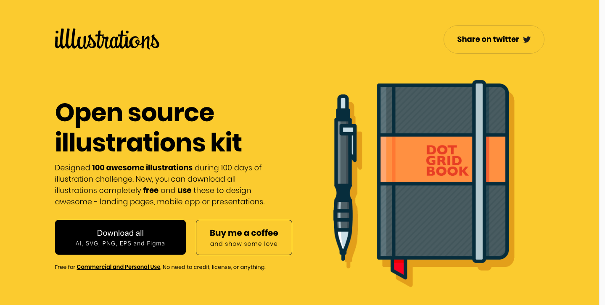
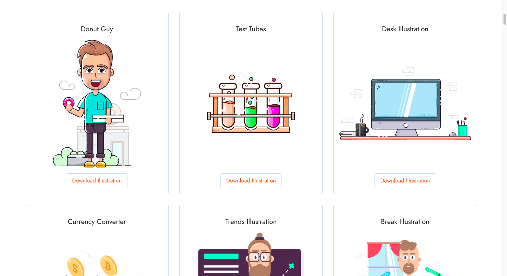
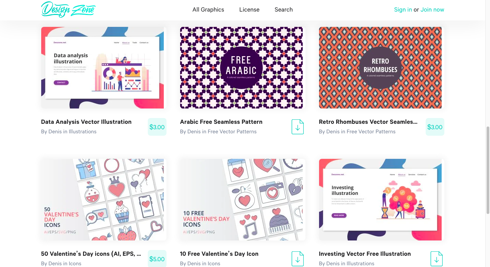
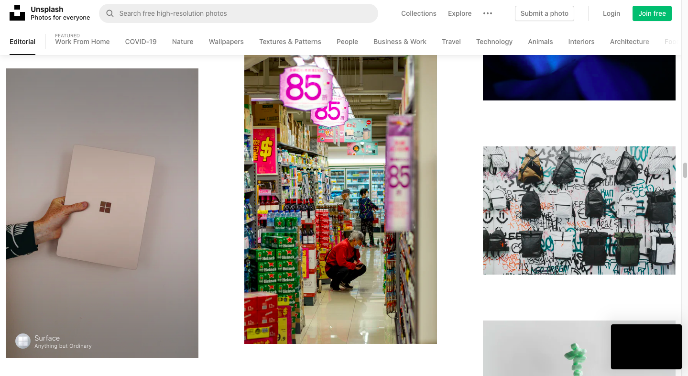
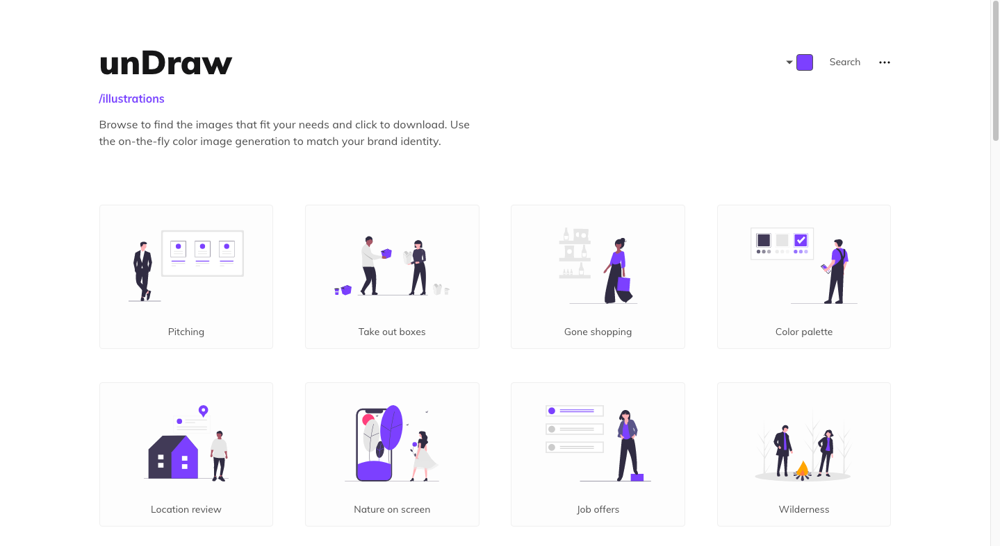
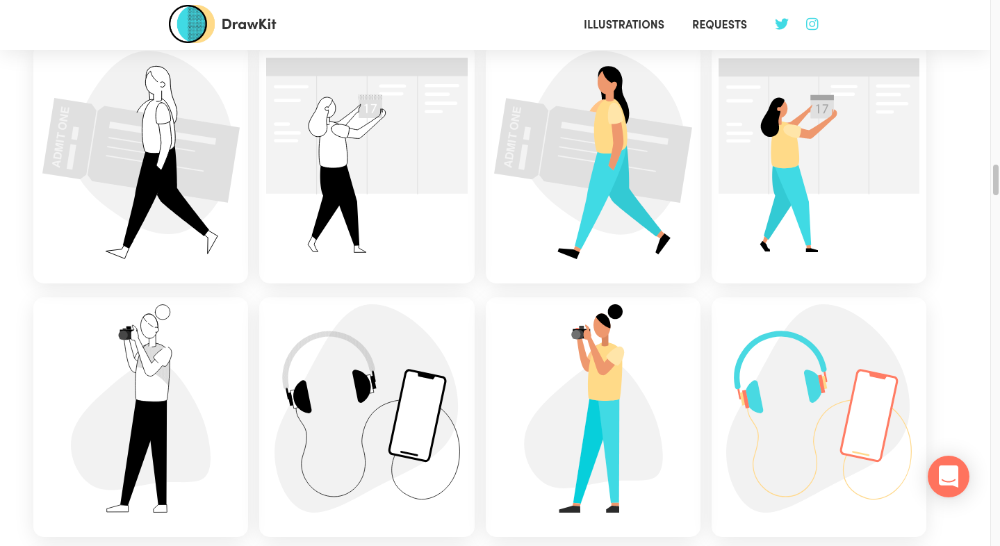
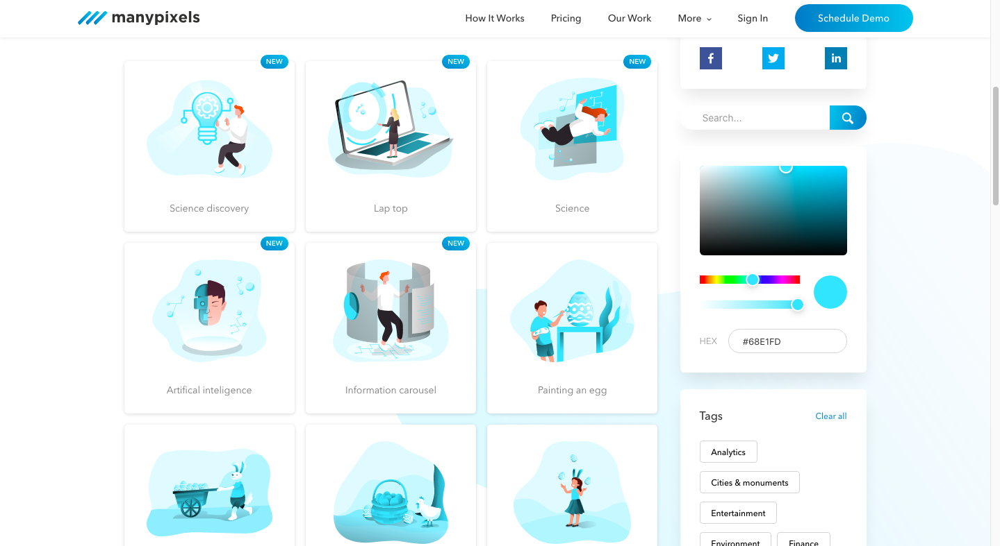

Список сайтов где можно найти иллюстрации, паттерны, иконки и фотографии которые можно бесплатно использовать в коммерческих и не коммерческих целях. Главная фишка в том что при использовании этих изображений вы не обязаны упоминать авторов и/или давать какие либо ссылки. Впрочем, конечно, никто не запрещает сделать это дабы поблагодарить авторов.

Лично я использую эти иллюстрации в опенсорсных проектах, к примеру, в Хроноблоге: [github.com/Chronoblog/gatsby-theme-chronoblog](https://github.com/Chronoblog/gatsby-theme-chronoblog) - в опенсорсном проекте я не могу, скажем, просто купить иллюстрацию и использовать ее, так как купил-то ее я, но тот кто будет использовать, скажем, стартер в котором используется эта иллюстрация, выходит, не имеет права использовать ее.

---

## https://illlustrations.co

Иллюстрации от дизайнера Vijay Verma, все, в примерно, одном и том же стиле - можно скачать в формате png и svg.

MIT лицензия: https://illlustrations.co/license

---

## https://lukaszadam.com/illustrations

Иллюстрации и иконки от дизайнера Lukasz Adam. Можно качать в png и svg.

Сайт плохо работает из России, так что возможно потребуются дополнительные усилия что бы открыть его.

MIT лицензия.

---

## https://deszone.net

Иллюстрации, иконки и паттерны. Много подборок посвященных какой-то тематике (социальные сети, животные и тд). Есть коммерческие подборки (обычно это расширенные бесплатные). Бесплатные можно использовать без упоминания авоторства.

Лицензия: https://deszone.net/license

---

## https://unsplash.com

Один из крупнейших сайтов где можно найти фотографий самых разных тематик. Все можно использовать без упоминания авторов, в том числе в коммерческих целях.

Лицензия: https://unsplash.com/license

---

## https://undraw.co/illustrations

Множество иллюстраций в одной стилистике. Можно изменить основной цвет иллюстраций прямо на сайте. Форматы png и svg.

Лицензия: https://undraw.co/license

---

## https://www.drawkit.io/free

Иллюстрации в одной стилистике (в основном с людьми) от James Daly. SVG и PNG.

MIT лицензия: https://www.drawkit.io/license

---

## https://www.manypixels.co/gallery

SVG и PNG иллюстрации, можно менять основной цвет прямо на сайте.

Лицензия: https://www.manypixels.co/gallery/license

---
