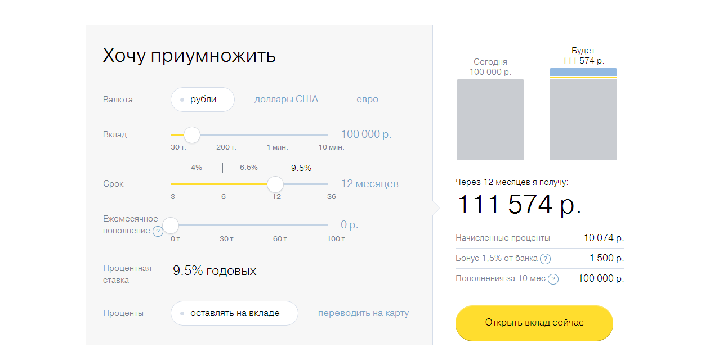
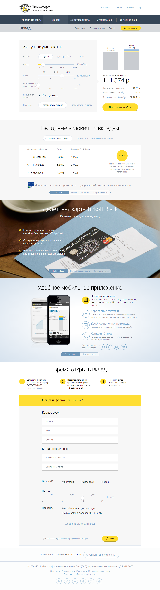

Когда цифры визуализируют всегда нужно быть на чеку.

Тиньков считает что 11 000 рублей в два раза больше 100 000 рублей.

Я только не понимаю какой в этом вообще смысл? Банковский вклад это не спонтанная покупка, это долгосрочные отношения в которых крайне важно доверие к банку. Какое может быть доверие когда уже на этапе знакомства банк пытается обмануть, при чем довольно примитивным и очевидным образом? Конечно они могут сказать что синяя часть рассчитывается по другим величинам или ещё что-то подобное, но все равно это какое-то мелкое жульничество которое плохо сочетается с репутацией надежного банка.

Кстати так калькулятор у Тинькова выглядел в апреле 2013 года, сейчас (июнь 2014) он выглядит уже так:

Во первых, да, он исправился и теперь показывает вменяемую визуализацию.

Во вторых удивительно как за один год изменились тенденции в дизайне и как чутко эти изменения использовал ТСК Банк. Никаких тебе градиентов, теней и прочего как у старого калькулятора — исключительно современный плоский и светлый дизайн.

Ну и в третьих, год назад на этой странице в банке Тинькова по суте был только этот калькулятор и все, теперь это длинный лендеринг, где калькулятор это только начало:

