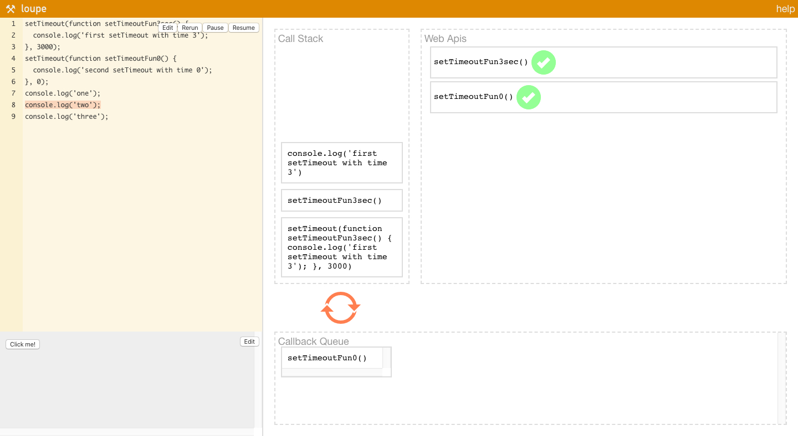

Эти пять интерактивных инструментов помогут вам понять как работает JavaScript, делая принципы работы языка и его окружения более очевидными.

Ни один из представленных инструментов не хуже и не лучше другого, JavaScript можно визуализировать очень по разному, так что что-то будет полезнее в одной ситуации, а что-то в другой.

## Latentflip: Loupe

[Latentflip: Loupe](http://latentflip.com/loupe)  
[github.com/latentflip/loupe](https://github.com/latentflip/loupe)

Известный и довольно старый визуализатор работы JS. Проект не без проблем - в нем не работают многие современные фичи джаваскрипта, в нем работает только латиница (не пытайтесь выводить в консоль кириллические символы), код для взаимодействия с браузером (нажатие на кнопку из дефолтного примера) использует, о ужас, jQuery!

Но это все еще один из самых наглядных визуализаторов не просто джаваскрипта, но и того как джаваскрипт взаимодействует с браузером, как происходит реакция на те или иные события (скажем, нажатие на кнопку), того как работает эвент луп, того как работают колбеки и тд.

## JavaScript Visualizer 9000

[www.jsv9000.app](https://www.jsv9000.app)  
[github.com/Hopding/js-visualizer-9000-client](https://github.com/Hopding/js-visualizer-9000-client)

Визуализатор вдохновленный Loupe. Интересен тем что он не просто показывает что происходит, но и объясняет что код делает.

В отличие от Loupe здесь нет возможности взаимодействовать с событиями, скажем, нельзя сделать кнопку и посмотреть что будет если нажать на нее, но в остальном это отличная альтернатива Loupe.

## Tyler McGinnis JavaScript Visualizer

[tylermcginnis.com/javascript-visualizer](https://tylermcginnis.com/javascript-visualizer/)

Этот визуализатор не очень многое умеет, он показывает как работают контексты, поднятия, замыкания и области видимости, и на этом, в принципе, все. Этот визуализатор отлично подходит если вам нужно разобраться в том как работают эти аспекты джаваскрипта. Но не ищите здесь эвент лупа и взаимодействия с веб апи.

## PythonTutor for JavaScript

[PythonTutor for JavaScript](http://www.pythontutor.com/javascript.html#)

Очень известный инструмент для визуализации джаваскрипта. Именно его часто используют для различных примеров в туториалах и в видео. Минус в том что он очень много не умеет, только взгляните на этот список того что он НЕ поддерживает: https://github.com/pgbovine/OnlinePythonTutor/blob/master/unsupported-features.md#javascript-unsupported-features

Ни `Date()`, ни асинхронных операций, и, конечно, никакого взаимодействия с DOM.

## js2flowchart

[github.com/Bogdan-Lyashenko/js-code-to-svg-flowchart](https://github.com/Bogdan-Lyashenko/js-code-to-svg-flowchart) - проект на гитхабе  
[bogdan-lyashenko.github.io/js-code-to-svg-flowchart/docs/live-editor/index.html](https://bogdan-lyashenko.github.io/js-code-to-svg-flowchart/docs/live-editor/index.html) - демо проекта

Этот инструмент создает диаграммы потоков данных из кода (они же flow - data flow diagrams). Это не совсем про то как работает JavaScript, а больше про визуализацию написанного вами кода.

Еще существует схожий проект: [code2flow.com](https://code2flow.com) - но он уже коммерческий.

К слову, если вам нужно просто нарисовать диаграмму (а не визуализировать какой-то код), вот отличный инструмент для этого: [www.draw.io](https://www.draw.io/)
