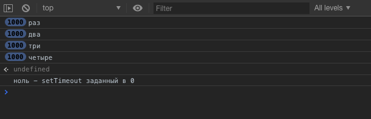

_Вольный и дополненный перевод вопроса и ответа со stackoverflow: [What is setTimeout doing when set to 0 milliseconds?](https://stackoverflow.com/questions/33955650/what-is-settimeout-doing-when-set-to-0-milliseconds)_

В JavaScript `setTimeout(callback, delay)` означает "вызови обратный вызов (callback) после задержки (delay)". Но что происходит если задать задержку в `**0**`? Получается, он должен вызвать коллбек сразу же? Может показаться что да, но на самом деле все сложнее.

Подумайте, что сделает этот код:

```javascript
setTimeout(function() {
  console.log('ноль - setTimeout заданный в 0');
}, 0); // Вызови это через ноль милисекунд

for (i = 0; i < 1000; i++) {
  console.log('раз');
}
for (i = 0; i < 1000; i++) {
  console.log('два');
}
for (i = 0; i < 1000; i++) {
  console.log('три');
}
for (i = 0; i < 1000; i++) {
  console.log('четыре');
}
```

Он должен отобразить `ноль - setTimeout заданный в 0` в самом начале? Не совсем, в Chrome он выдаст это:



Почему-то JavaScript сначало прописывает четыре тысячи других логов в консоль, и только после этого прописывает `ноль - setTimeout заданный в 0`.

## Как работает `setTimeout` и `callback` в JavaScript

Три полезных факта:

1. JavaScript это однопоточный (single-threaded) язык программирования. Асинхронные обратные вызовы назначаются _сообщению_, помещенному в _очередь сообщений_ (message queue).
2. Если в данный момент не выполняется ни один код, цикл обработки событий ( event loop, он же эвент луп) опрашивает очередь сообщений, запрашивая следующее сообщение в строке для обработки (выполнения).
3. `setTimeout` добавляет сообщение (с обратным вызовом) в конец этой очереди после истечения указанной задержки.

> Важно понимать что задержка в вызове `setTimeout` не надежна, это **минимальная задержка** перед выполнением обратного вызова. На самом деле многое зависит от того сколько времени потребуется для обработки любых операций предшествующих ему в очереди.

Так что же все таки происходит, если задержка установлена ​​на `0`? Новое сообщение будет немедленно добавлено в очередь, но обработано оно будет только после того как текущий исполняемый код будет завершен и все ранее добавленные сообщения будут обработаны.

## Что происходит в коде

Когда мы вызываем `setTimeout`...

```javascript
setTimeout(function() {
  console.log('ноль - setTimeout заданный в 0');
}, 0);
```

…сообщение добавляется в очередь с указанным обратным вызовом. А остальная часть кода...

```javascript
for (i = 0; i < 1000; i++) {
  console.log('раз');
}
// и тд.
```

...продолжает выполняться синхронно. Как только этот код полностью завершится, цикл обработки событий (event loop - эвент луп) начнет опрашивать очередь сообщений на наличие следующего сообщения. Он найдет сообщение с обратным вызовом (callback) `setTimeout`, после чего начнется его обработка(выполнение обратного вызова).

Проще говоря, обратный вызов выполняется только после завершения текущего выполняемого кода, независимо от того, сколько времени это займет.

## Дальнейшее изучение

https://developer.mozilla.org/en-US/docs/Web/JavaScript/EventLoop

http://blog.carbonfive.com/2013/10/27/the-javascript-event-loop-explained/
