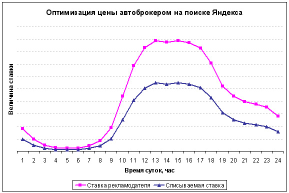

Большинство рекламодателей отключают рекламу в период с 22:00 и по 09:00. Это конечно же логично по ряду причин:

- Некому принимать звонки и заявки, если клиент позвонит в два часа ночи ему просто никто не ответит.
- Так как рекламодатель платит за каждый клик нет смысла «сливать» бюджет на эти бесполезные клики.

Однако эти две проблемы легко решаемы, и нет ни малейшего смыла отказываться от потенциальных ночных клиентов.

График от Яндекса с показом цен в разное время суток:

Не трудно догадаться что ночью цены на клик минимальны. Это конечно же связано с тем что большинство рекламодателей не показывают объявления ночью, показов в это время мало, ну и тд.

По этой причине эти клики будут практически бесплатны, а выбраться в самый верх спецразмещения будет не сложно.

Однако остается главная проблема — никто из отдела продаж просто не возьмет трубку в ответ на звонок клиента. Но кто сказал что номер телефона нужно обязательно показывать ночью? Посадочная страница для вашего объявления в директе и адвордс должна отличаться от «дневной» и просто не иметь номера телефона. Форма обратного звонка и кнопка «перезвонить» должны остаться единственными элементами для контактов (они же у вас есть, да?).

Страница благодарности так же должна быть немного другой — в ней должно сообщаться о том что клиенту перезвонят, скажем, в период с 10:00 до 11:00. Соответственно менеджеры просто звонят клиентам оставившим заявки как обычно, при чем что бы они не забыли позвонить в определенный промежуток времени стоит добавить к стандартной форме отправки напоминание о том что «ночникам» нужно звонить с 10:00 до 11:00.

Как вариант тут можно ещё много чего придумать, например дать возможность клиенту ввести конкретное время для звонка. Днем эта функция как правило излишня (так как позвонить клиенту компания должна в ближайшее время), но ночью может пригодиться.

В интерфейсе Директа и АдВордс лучше всего сделать под ночные объявления отдельные кампании. Так их будет проще контролировать. Кстати в Директе имеет смыл поставить автоматическую стратегию на максимальное количество кликов, это как правило не целесообразная стратегия, но в ночное время она оптимальна.

Сами объявление имеет смысл заточить специально под ночных клиентов, при этом не стоит зацикливаться на «ночных скидках», имеет смысл пойти дальше. Подумайте почему ваши клиенты ищут вас ночью? Какие клиенты могут вас искать в такое время суток? Когда наберется достаточная статистика можно проанализировать чем «ночные» отличаются от «дневных», например может они вводят немного другие ключевые слова и на основе этого придумать специальные ночные объявления.

## Что дают ночные показы?

Новые клиенты которые возможно на вас бы иначе не вышли, да, едва ли таких будет много, но и обойдутся они вам за копейки.

Если же таких клиентов окажется какое-то заметное число то это будет знаком к тому что возможно «ночное» продвижение имеет смысл расширить, вплоть до приема заявок 24 часа в сутки по телефону. Мало ли, вдруг ваши клиенты готовы заказывать ночью, а вы просто не знаете об этом?
